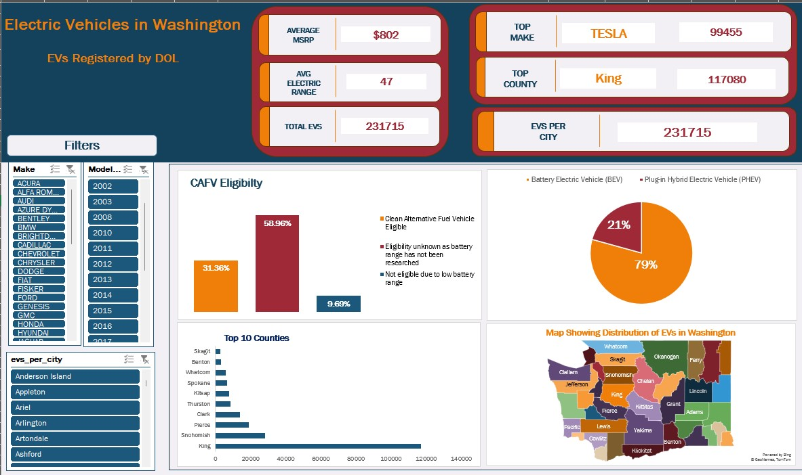

## Electric Vehicles in Washington

The data viz shows the EVs in Washington as registered by the Department of Licensing. This data covers the EVs registered in the different cities and counties in the state of Washington in tht years 1999-2025. There details of these vehicles are recorded classifying the vehicles by model, make, electric type that is whether they are Battery Electric Vehicles(BEVs) or Plug-in Hybrid Electric Vehicles(PHEVs), and if they are Clean Alternative Fuel Vehicle(CAFV) eligible, Electric Utility Range and finally the Base Manufacturer's Suggested Retail Price(MSRP). The Vehicle Identification Numbers and the location of these EVs with other registration details were recorded by the DOL.

## Data Cleaning
1. Got rid of the empty columns and rows from the dataset.
2. Did the formatting of the data and checked for outliers in the data. Plug-in Hybrid Electric Vehicles can go on a 15-60 miles on a single charge while BEVs can go from 110 to over 300 miles on a single charge. Values in this category fell under the data range except for a few whereby the data fell below 15 miles which is the minimunm value range. However, there are other factors which can affect this like the recharging of the batteries whereby they are classified as **Level 1** in charging adds 2-5 miles per our of charge, **Level 2** units of charging adds 10 - 30 miles per a hour of cahrging, and **DC fast** units can add 100–200+ miles of range in as little as 30 minutes. The source is [The Department of Energy](https://www.google.com/url?sa=t&source=web&rct=j&opi=89978449&url=https://afdc.energy.gov/files/u/publication/electric-drive_vehicles.pdf&ved=2ahUKEwjenePiyqCMAxUvSPEDHazfNKAQFnoECBYQAw&usg=AOvVaw15oUT5c0gtdHLI1_7DNuFm).

## Data Analysis
I anlysed the data in Excel spreadsheets. I used pivot talbes to analyze an group the data to meet our needs. Secondly, I sorted data in decsending order for som e tables. Finally, I filtered out the data uing specific the _Make_, _City_ and _Model._ to obtain meaningful insights using slicers.

# Data Visualization
The findings were visualized using charts, text boxes and tables to obtain meaningful insights that would guide us through the research as shown on the visualization below:

## Findings

## Conclusion